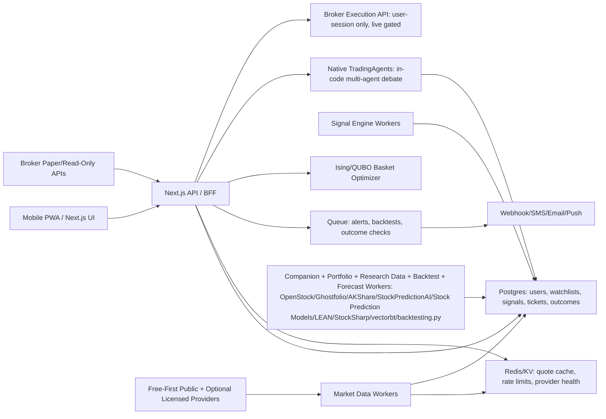

# Architecture

## Current System

Trading Intelligence Platform is a Next.js App Router application deployed on Vercel.

Runtime shape:

- Browser dashboard renders the trading command center.
- Serverless API routes fetch market data, generate rule-based signals, create trade tickets, and expose readiness metadata.
- The Ising/QUBO optimizer chooses baskets from generated buy leads under budget, risk, max-position, and overlap constraints.
- Broker routes can connect to Alpaca account, positions, open orders, and guarded order placement when credentials are configured.
- Vercel Cron calls `/api/monitor` every five minutes.
- Alerts use free browser notifications first; webhook, Twilio, or Resend are optional off-device channels when configured.
- Browser `localStorage` stores the current mobile watchlist and local notes.
- When `DATABASE_URL` is configured and `database/schema.sql` is applied, Postgres stores quote snapshots, signal snapshots, paper trades, model outcomes, provider health, and audit events.

## Production Boundary

The current application is safe-by-default for research, paper planning, and guarded broker operations. It includes broker execution routes for authenticated manual paper and live limit orders when Alpaca credentials, audit storage, acknowledgement, and pre-trade controls are configured.

Production real-money trading requires these external systems before live execution is even considered:

- Free-first research data is implemented; licensed real-time market data is required only before execution-grade promotion.
- Persistent database with the provided schema applied.
- Broker execution account gates, live acknowledgement, and order audit storage.
- Historical backtesting, companion market-app, portfolio analytics, research data, and ML forecast workers, including optional OpenStock, Ghostfolio, AKShare, StockSharp C#/.NET, StockPredictionAI-style, and Stock Prediction Models worker integrations.
- Signal outcome tracker.
- Immutable audit retention and export policy beyond the current audit-events table.
- User auth and RBAC.
- Compliance, Terms, Privacy, and risk disclosures.

## Target Production Architecture

## Non-Negotiable Guardrails

- Never synthesize market data in production.
- Never promote stale quotes to buy/sell actions.
- Never place live orders from the app until paper results, audit logs, broker permissions, and operator approvals exist.
- Never allow cron or agent bearer tokens to place broker orders.
- Never let TradingAgents, OpenStock, Ghostfolio, AKShare, StockPredictionAI, Stock Prediction Models, or StockSharp worker output place autonomous broker orders; manual paper/live execution stays in the broker controls and audit rail.
- Never submit a market order from the current execution rail.
- Never treat the Ising optimizer as a price predictor; it only selects among existing candidates.
- Never allow auth to fail open.
- Every signal must have an immutable stored snapshot before it can be evaluated.
